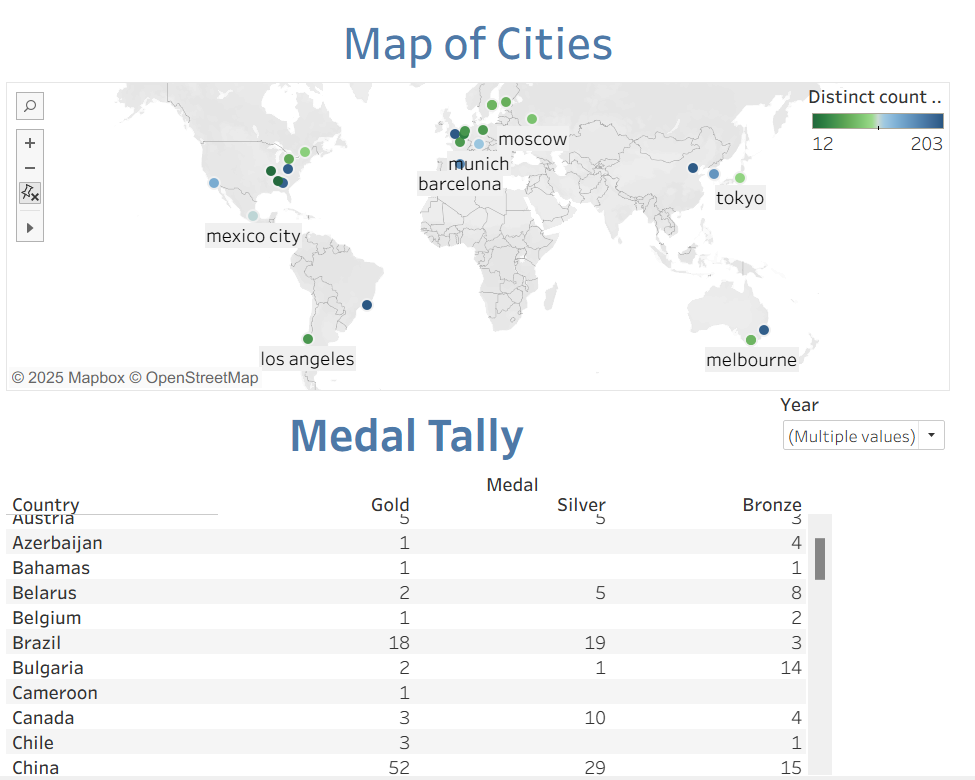
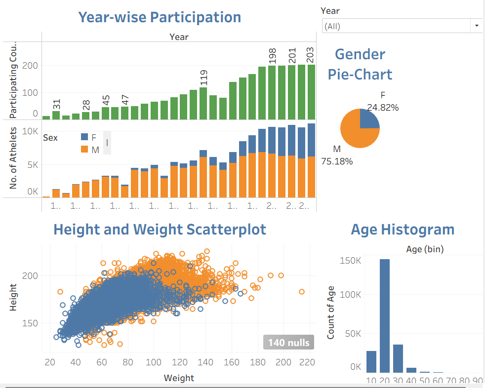
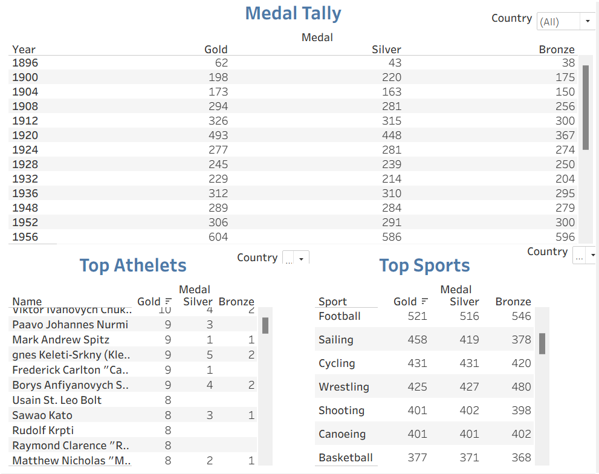

# Story of Olympics 🏅📊

## 📌 Overview
This Tableau project tells the **story of the Olympics** through three interactive dashboards.  
It combines two datasets:  
- **Olympics Dataset** – athletes, events, medals, participation , year
- **Cities Dataset** – host city information  , year

The goal of this project is to explore Olympic history, analyze participation trends, and highlight country-wise performances and athletes.

---

## 🖼 Story Points & Dashboards

### 1️⃣ Overall
- World map showing host cities of the Olympics 🌍  
- Medal tally by country 🏆  

---

### 2️⃣ Overall EDA
- Year-wise participation of athletes and countries 📈  
- Height vs. Weight scatterplot ⚖️  
- Gender distribution (pie chart) 👩‍🦰👨‍🦱  
- Age distribution (histogram) 🎂  

---

### 3️⃣ Country-Wise Analysis
- Year-wise medal tally of a selected country 🥇🥈🥉  
- Top athletes by country 👑  
- Top sports by country ⚽🏊‍♂️🏸  

---

## 🔗 Live Project
- 🌐 **[View Interactive Story on Tableau Public](https://public.tableau.com/views/Olympics-EDA_17591736472950/TheStoryofOlympics?:language=en-US&publish=yes&:sid=&:redirect=auth&:display_count=n&:origin=viz_share_link)**

---

## 📂 Files in this Repository
- `Story_of_Olympics.twbx` → Tableau packaged workbook (dashboard + data)  
- `olympics_dataset.csv` → Dataset (public)  
- `cities_dataset.csv` → Dataset (public)  
- `overall.png` → Screenshot of Overall dashboard  
- `overall_eda.png` → Screenshot of Overall EDA dashboard  
- `country_wise.png` → Screenshot of Country-wise dashboard  
- `README.md` → Documentation  

---

## ⚙️ How to Open
1. Download the `.twbx` file.  
2. Open it in **Tableau Desktop** or **Tableau Public Desktop (Free)**.  

---

## ✨ Key Insights
- Olympic participation has steadily grown over the years 📈  
- Female participation has increased, narrowing the gender gap 🙋‍♀️🙋‍♂️  
- Certain countries dominate medal tallies consistently 🏅  
- Country-wise breakdown reveals standout athletes and sports 🌍  
